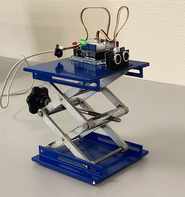
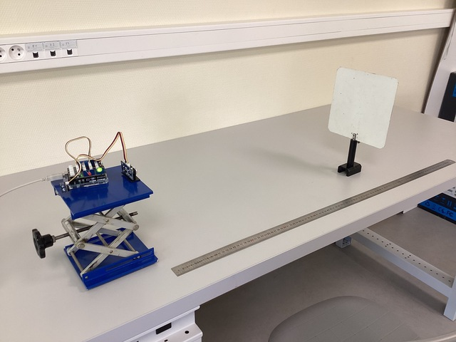
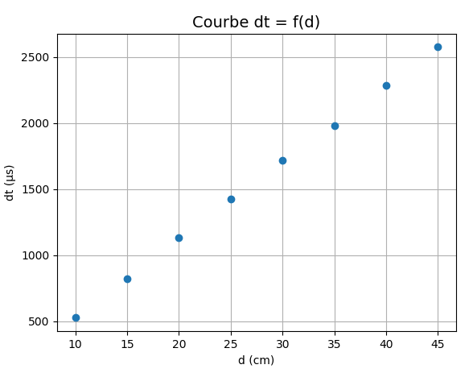

## Célérité des ultrasons dans l'air - Mode d'emploi

Cet exemple de `mesures point par point` à l'aide de la bibliothèque `pyduino`  utilise directement les données mesurées par le capteur à ultrasons.

**Important**

Le dialogue entre le programme _python_ et la carte _arduino_  doit impérativement suivre le protocole suivant:

- le programme _python_ envoie une commande sous forme de chaine de caractères sur la liaison série.
- le programme _arduino_ reçoit la commande, la traite et envoie une réponse sur la liaison série.

### Montage

<table style="display:inline-block">
<tr><td></td><td></td></tr>
</table>

### Code arduino

Le programme doit:
- attendre l'arrivée de la commande `mesure` sur la liaison série et réagir en conséquence, c'est à dire effectuer une mesure de la durée aller retour de l'onde ultrasonore émise par le capteur.
- envoyer cette durée sur la liaison série

Voir à cet effet les commentaires dans le code source [capteur_us](../../arduino/capteur_us/capteur_us.ino).

### Code python

Algorithme du code _python_ [ultrasons_mesure.py](../../tests/ultrasons_mesure.py) :

- Tant qu'il y a des points à mesurer, le programme:
    - demande à l'utilisateur la valeur $d$ de la distance capteur_us-écran en cm.
    - envoie la commande `mesure` sur la liaison série.
    - lorsqu'il reçoit la réponse $\Delta t$ envoyée par la carte, affiche le couple  $(d, \Delta t)$
- à la sortie de la boucle, le graphe $\Delta t = f(d)$ est affiché.
- à la fermeture du graphe, une sauvegarde des données sous forme de fichier csv est proposée.

**Remarque :** Avant utilisation il est nécessaire de modifier la valeur du port _COM_.

### Exemple de résultats

### Exemple d'utilisation

Le protocole [tp_ultrasons.md](exemple_TP/tp_ultrasons.md) et le notebook [ultrasons_traitement.ipynb](exemple_TP/ultrasons_traitement.ipynb) et proposent un exemple de traitement des données qui peut servir de base pour un TP. Il s'agit de déterminer la célérité du son dans l'air avec évaluation des incertitudes de mesures et d'appliquer ce résultat à la réalisation d'un radar de recul.