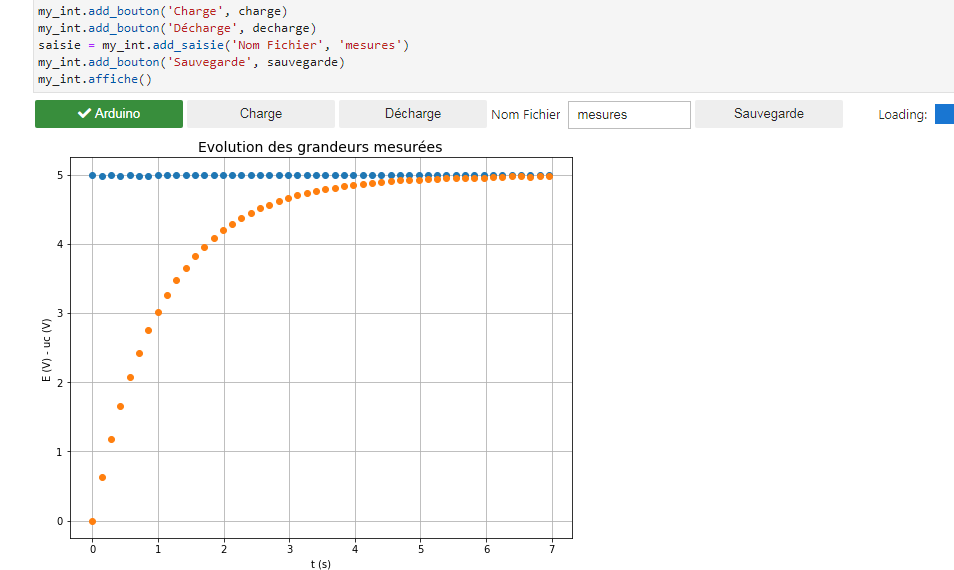

# Circuit RC - Mode d'emploi

La charge ou la décharge d'un condensateur à travers une résistance est un cas d'école pour illustrer toutes les possibilité des mesures temporelle offertes par la biblothèque `pduino`.

**Important**

Comme dans tous les exemples utilisant `pduino` le dialogue entre le programme _python_ et la carte _arduino_  doit impérativement suivre le protocole suivant:

- le programme _python_ envoie une commande sous forme de chaine de caractères sur la liaison série.
- le programme _arduino_ reçoit la commande, la traite et envoie une réponse sur la liaison série.

## I. Montage sans déclenchement
Dans ce montage, c'est le programme qui déclenche la charge du condensateur en plaçant le pin 3 l'état haut au début des mesures.

#### Montage 

Les leds sont présentes uniquement dans un but de visualisation. Il est possible de les supprimer.

### Code arduino

Il existe deux versions:

- le programme  [condo.ino](../../arduino/condo/condo.ino) pour lequel la constante de temps du circuit peut être de quelques secondes qui envoie les valeurs sous la forme d'un entier (entre 0 et 1023) sur la liaison série après chaque mesure.
- le programme  [condo_rapide.ino](../../arduino/condo_rapide/condo_rapide.ino) pour lequel la constante de temps du circuit peut être de quelques centaines de millisecondes qui, dans un but de rapidité, envoie les toutes valeurs une fois que les mesures sont terminées.

Dans un but de démonstration, ces programmes laissent au code python le soin de calculer les tensions correspondantes aux entiers transmis en utilisant des fonctions qui sont passées comme arguments à la méthode `mesures_tempo` de la classe `Arduino` (voir _[mesures_rc.py](../../tests_pduino/mesures_rc.py)_), mais ces valeurs pourraient bien sûr être calculées par le code arduino (voir _[mesures_rc_dec.py](../../tests_pduino/mesures_rc_dec.py)_)

##### Fonctionnement

Le programme:

- attend l'arrivée d'une commande (`charge` ou `decharge`) sur la liaison série et réagit en conséquence:
- si la commande est `charge`, il place le pin 3 à l'état haut et effectue la série de mesure. Chaque mesure est envoyée sur la liaison série juste après sa réalisation. la série se termine par l'envoi du mot `end`.
- si la commande est `decharge`, il place le pin 3 à l'état bas  et effectue la série de mesures comme précédement.

### Code python
Le [programme _python_](../../tests_pduino/mesures_rc.py):
- envoie une commande parmi `charge` ou `decharge` ou sur la liaison série.
- recupère et convertit en tension les données lues sur la liaison série.
- affiche le graphe

La commande `sauve` permet de réaliser une sauvergarde sous forme de fichier `csv`.

**Remarque :** Avant utilisation il peut-être nécessaire de modifier la valeur du port _COM_.

### Exemple d'éxécution
- Avec _python_

- Avec _Jupyter_ en utilisant `juduino`

## II. Montage avec déclenchement
Dans ce montage, le programme attend que l'utilisateur appuie sur le bouton (ce qui provoque l'apparition d'un niveau haut sur le pin 7) pour débuter la série de mesures.

#### Montage 

### Code arduino

Il existe également deux versions:

- le programme  [condo_dec.ino](../../arduino/condo_dec/condo_dec.ino) pour lequel la constante de temps du circuit peut être de quelques secondes. Celui-ci envoie les valeurs sur la liaison série après chaque mesure.
- le programme  [condo_rapide_dec .ino](../../arduino/condo_rapide_dec/condo_rapide_dec.ino) pour lequel la constante de temps du circuit peut être de quelques centaines de millisecondes qui envoie les toutes valeurs une fois que les mesures sont terminées.

Dans un but de démonstration, cette fois-ci, les tensions sont calculées avant de les envoyer (voir _[mesures_rc_dec.py](../../tests_pduino/mesures_rc_dec.py)_).

### Code python
Le [programme _python_](../../tests_pduino/mesures_rc.py):
- envoie la commande `charge` sur la liaison série.
- attend que l'utilisateur appuie sur le bouton pour déclencher la charge.
- recupère les tensions lues sur la liaison série.
- affiche le graphe.

La commande `sauve` permet de réaliser une sauvergarde sous forme de fichier `csv`.

**Remarque** Avant utilisation il peut-être nécessaire de modifier la valeur du port _COM_.

**Remarque**

Si vous utilisez _Jupyter_ et `juduino` un exemple de mesures sous _Jupyter_ est donné dans le notebook [tests_juduino/test_circuit_rc.ipynb](../../tests_juduino/test_circuit_rc.ipynb)

## III. Exemple d'utilisation

Le notebook [circuit_rc_traitement.ipynb](circuit_rc_traitement.ipynb) propose un exemple d'utilisation d'un fichier de mesures dans le but de déterminer la constante de temps d'un circuit RC.