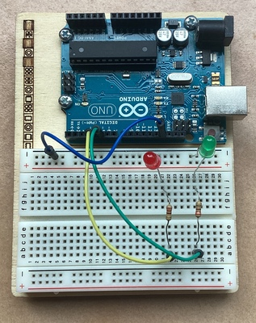
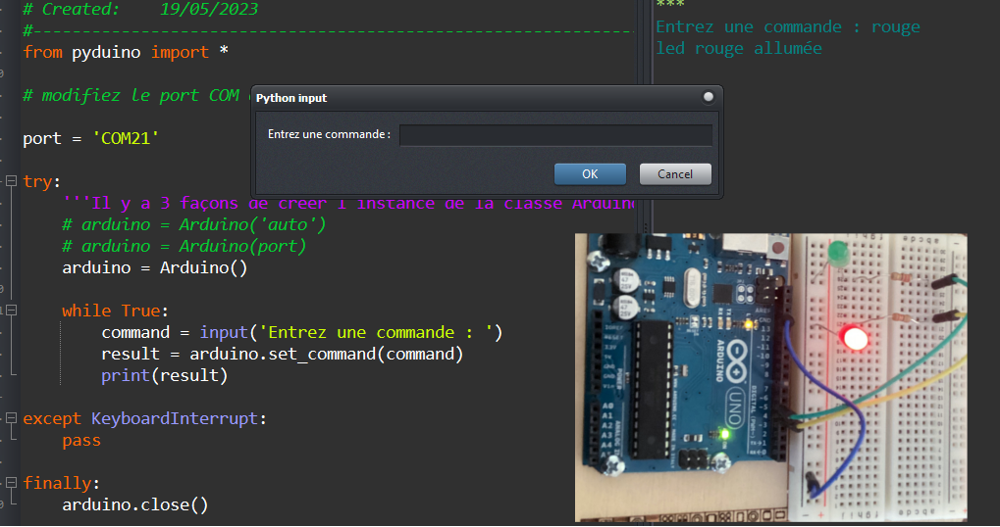
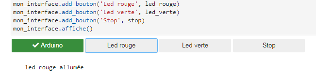

## Commande de leds - Mode d'emploi

Cet exemple simple permet de prendre en main la bibliothèque `pyduino`.  Il s'agit de commander l'allumage de deux leds grâce à un script _python_.

**Important**

Le dialogue entre le programme _python_ et la carte _arduino_  doit impérativement suivre le protocole suivant:

- le programme _python_ envoie une commande sous forme de chaine de caractères sur la liaison série.
- le programme _arduino_ reçoit la commande, la traite et envoie une réponse sur la liaison série.

### Montage

<table style="display:inline-block">
<tr><td></td><td></td></tr>
</table>

### Code arduino

Le programme doit:

- attendre l'arrivée d'une commande (`rouge`, `verte`ou `stop`) sur la liaison série et réagir en conséquence.
- envoyer une réponse sous forme de caractère.

Voir à cet effet les commentaires dans le code source [leds.ino](../../arduino/leds/leds.ino).

### Code python

Le [programme _python_](../../tests_pyduino/commande_leds.py):
- envoie une commande parmi `rouge`, `verte`ou `stop` sur la liaison série à la demande de l'utilisateur.
- affiche la réponse envoyée par la carte.

**Remarque :** Avant utilisation il peut-être nécessaire de modifier la valeur du port _COM_.

#### Exemple d'exécution

### Code Jupyter

Si vous avez installé `juduino` le document [./tests_juduino/test_command.ipynb](../../tests_juduino/test_command.ipynb) permet de prendre en main le sytème avec Jupyter
- Avec _Jupyter_ en utilisant `juduino`

#### Exemple d'exécution

