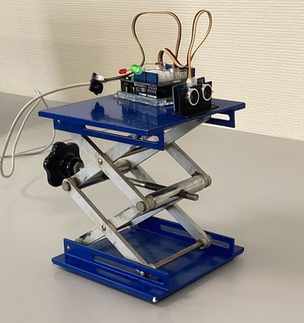
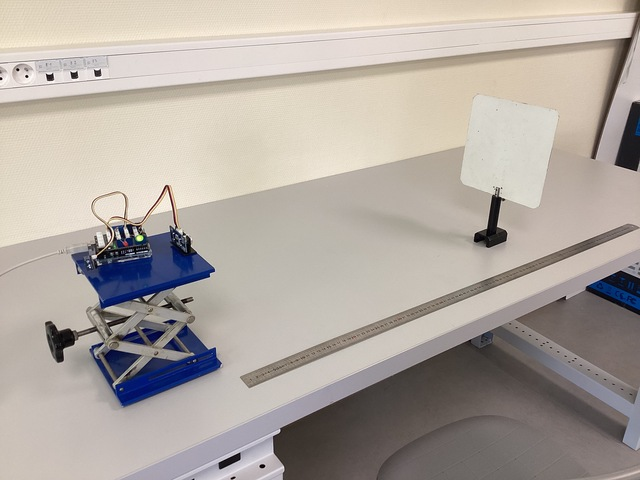
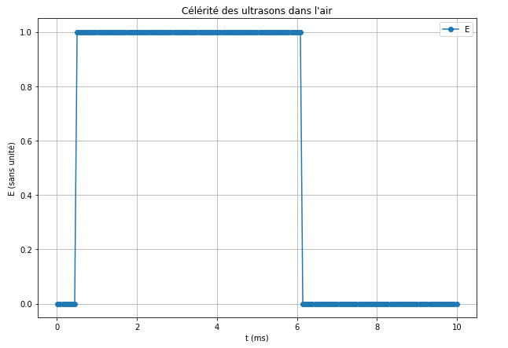
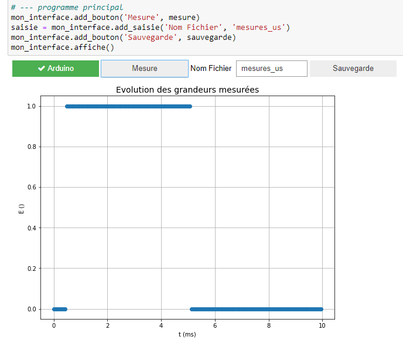

## Célérité des ultrasons dans l'air - Mesures temporelles

Le capteur us grove est relié au **pin 4** par exemple. 
Cet exemple de `mesures temporelles rapides` à l'aide de la bibliothèque `pyduino` permet de déterminer la célérité des ultrasons dans l'air en traçant l'évolution de l'état du **pin 4** en fonction du temps.

**Important**

Le dialogue entre le programme _python_ et la carte _arduino_  doit impérativement suivre le protocole suivant:

- le programme _python_ envoie une commande sous forme de chaine de caractères sur la liaison série.
- le programme _arduino_ reçoit la commande, la traite et envoie une réponse sur la liaison série.

### Montage

<table style="display:inline-block">
<tr><td></td><td></td></tr>
</table>

### Code arduino

Le programme doit:
- attendre l'arrivée de la commande `mesure` sur la liaison série et réagir en conséquence, c'est à dire effectuer une série de mesures de l'état du **pin 4** 
pendant une durée $\Delta t$ (par exemple 10ms)
- envoyer cette série de mesures sur la laision série.

Voir à cet effet les commentaires dans le code source [capteur_us_tempo](../../arduino/capteur_us_tempo/capteur_us_tempo.ino).

### Code python

Algorithme du code _python_ [ultrasons_mesure_tempo.py](../../tests/ultrasons_mesure_tempo.py) :

Le programme:
- envoie la commande `mesure`sur la liaison série.
- recupère les données lues sur la liaison série.
- affiche le graphe.

La commande `sauve` permet de réaliser une sauvergarde sous forme de fichier `csv`.

**Remarque :** Avant utilisation il est nécessaire de modifier la valeur du port _COM_.

### Exemple de résultats

### Exemple d'utilisation

Le notebook [ultrasons_tempo_traitement.ipynb](ultrasons_tempo_traitement.ipynb) proposent un exemple de traitement des données qui peut servir de base pour un TP.

**Remarque**

Si vous utilisez _Jupyter_ et `juduino` un exemple de mesures sous _Jupyter_ est donné dans le notebook [dev/test_ultrasons_tempo.ipynb](../../dev/test_ultrasons_tempo.ipynb)

